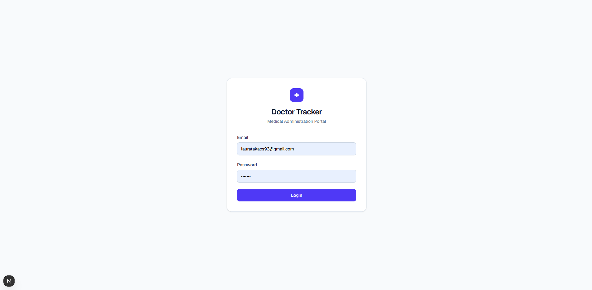
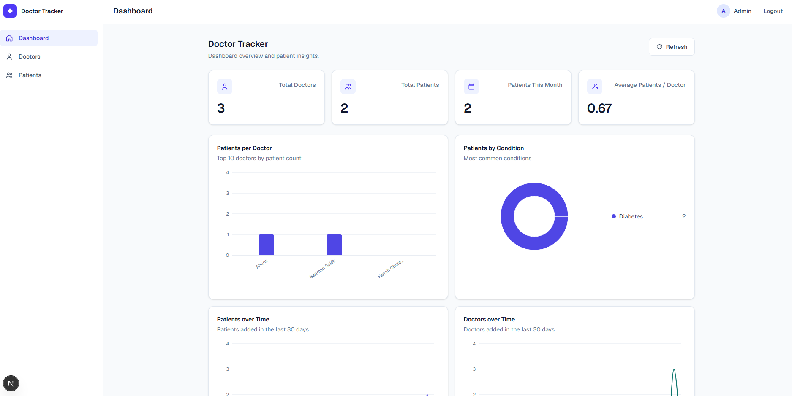
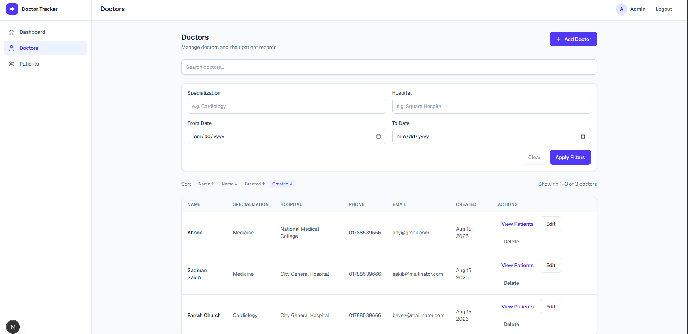
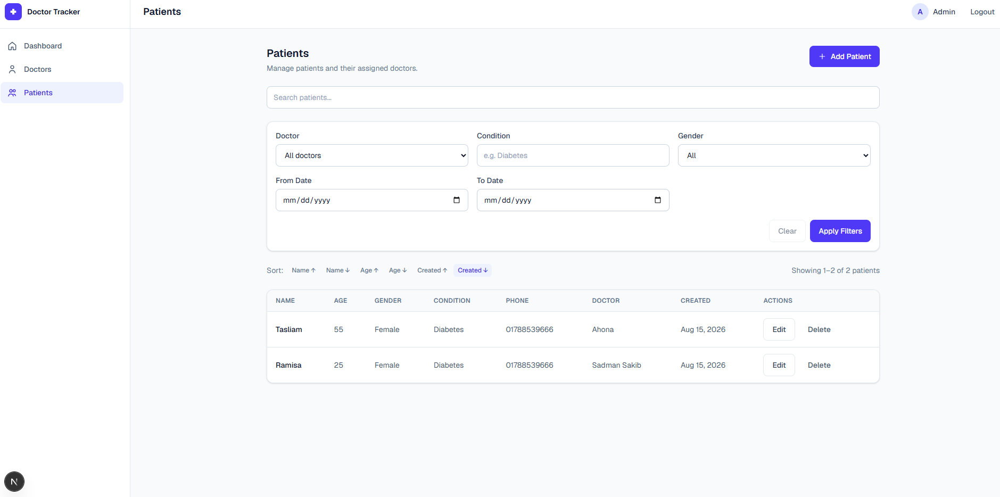
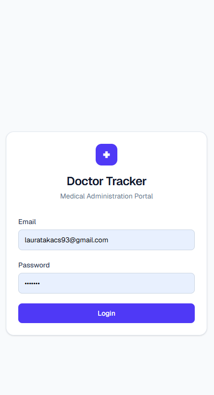
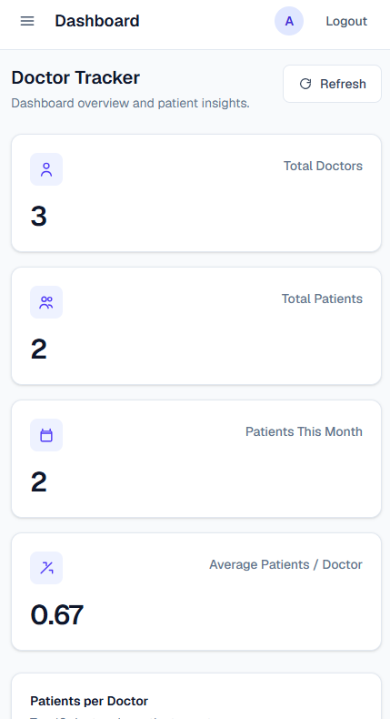
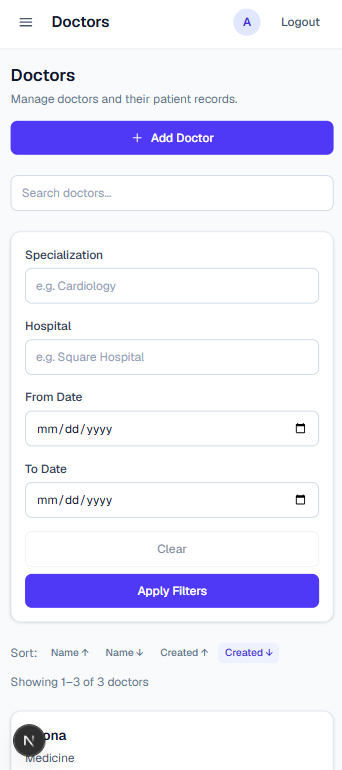

# Doctor Tracker

## Description

Doctor Tracker is a medical administration portal for managing doctors, assigned patients, and clinic analytics. An authenticated admin can create and maintain records, search and filter lists on the server, and review KPI cards and charts built from MongoDB aggregations.

## Features

- **Admin authentication** — JWT login with a seeded admin account
- **Doctor management** — create, view, update, and delete doctors
- **Patient management** — create, view, update, and delete patients
- **Search** — case-insensitive search on doctor and patient lists
- **Filtering** — specialization, hospital, condition, gender, doctor, and date range
- **Sorting** — name, created date, and (for patients) age
- **Pagination** — server-side pages with a default limit of 10
- **Doctor-specific patient management** — view and manage patients for one doctor
- **Dashboard analytics** — totals, patients this month, and average patients per doctor
- **Data visualization** — Recharts charts for patients per doctor, conditions, and 30-day trends
- **Responsive UI** — desktop sidebar and tables; mobile drawer and cards

## Tech Stack

### Frontend

- Next.js
- React
- Tailwind CSS
- Recharts
- JavaScript

### Backend

- Node.js
- Express
- Mongoose
- JWT (`jsonwebtoken`)
- bcrypt

### Database

- MongoDB Atlas (connection string via `MONGODB_URI`; a local MongoDB instance also works)

## Project Structure

```
Doctor-Tracker/
├── frontend/
│   ├── app/                 # Next.js App Router pages and layouts
│   ├── components/          # Dashboard, doctors, patients, layout, shared UI
│   ├── hooks/
│   ├── lib/                 # Auth helpers and API client
│   ├── services/            # Auth, doctor, patient, and dashboard API calls
│   ├── package.json
│   └── .env.example
│
├── backend/
│   ├── src/
│   │   ├── config/          # Env and MongoDB connection
│   │   ├── controllers/
│   │   ├── middleware/      # JWT auth, 404, error handler
│   │   ├── models/          # User, Doctor, Patient
│   │   ├── routes/
│   │   ├── scripts/         # Admin seed
│   │   ├── utils/           # JWT helpers and ApiError
│   │   ├── app.js
│   │   └── server.js
│   ├── package.json
│   └── .env.example
│
├── docs/
│   └── screenshots/
│
└── README.md
```

## System Architecture

```
Browser → Next.js frontend → REST API → Express backend → MongoDB
```

The frontend never talks to MongoDB. Protected pages call JSON endpoints with a Bearer token. Express verifies the JWT, Mongoose reads or writes documents, and dashboard aggregations run in MongoDB before results reach the browser.

**Auth flow:** the admin posts email and password to `POST /api/auth/login`. The API finds the user, compares the password with bcrypt, and returns a JWT (7-day expiry) plus a small user object. The frontend stores both in `localStorage` (`doctor-tracker-token` and `doctor-tracker-user`) and sends `Authorization: Bearer <token>` on later requests. Invalid or expired tokens return `401`; the UI clears auth and redirects to `/login`.

**List flow:** search, filters, sort, and page live in the URL (for example `/doctors?search=...&page=2`). The page sends those query params to the API. The browser does not download the full collection and filter it locally.

## Getting Started

### Prerequisites

- Node.js 20+
- npm
- A MongoDB Atlas cluster (or a local MongoDB instance)

### Clone Repository

```bash
git clone https://github.com/SadmanSakib71/Doctor-Tracker.git
cd Doctor-Tracker
```

### Backend Setup

```bash
cd backend
cp .env.example .env
npm install
```

On Windows PowerShell:

```powershell
cd backend
Copy-Item .env.example .env
npm install
```

Fill in `backend/.env` (never commit this file):

```
PORT=5000
MONGODB_URI=
JWT_SECRET=
CLIENT_URL=http://localhost:3000
ADMIN_NAME=
ADMIN_EMAIL=
ADMIN_PASSWORD=
```

| Variable         | Purpose                                       |
| ---------------- | --------------------------------------------- |
| `PORT`           | API port (default `5000`)                     |
| `MONGODB_URI`    | MongoDB connection string                     |
| `JWT_SECRET`     | Secret used to sign and verify JWTs           |
| `CLIENT_URL`     | Frontend origin allowed by CORS               |
| `ADMIN_NAME`     | Display name for the seeded admin             |
| `ADMIN_EMAIL`    | Email for the seeded admin                    |
| `ADMIN_PASSWORD` | Plain password hashed with bcrypt during seed |

Then start the API:

```bash
npm run dev
```

The API listens on `http://localhost:5000` by default. Use `npm start` for a non-watch process.

### Admin Seed

From `backend`, after `.env` is filled in:

```bash
npm run seed:admin
```

This creates one admin from `ADMIN_NAME`, `ADMIN_EMAIL`, and `ADMIN_PASSWORD`. If an admin already exists, the script skips creation.

### Frontend Setup

```bash
cd frontend
cp .env.example .env.local
npm install
```

On Windows PowerShell:

```powershell
cd frontend
Copy-Item .env.example .env.local
npm install
```

`frontend/.env.example`:

```
NEXT_PUBLIC_API_URL=http://localhost:5000/api
```

| Variable              | Purpose              |
| --------------------- | -------------------- |
| `NEXT_PUBLIC_API_URL` | Backend API base URL |

Do not commit `.env` or `.env.local`. Then start the frontend:

```bash
npm run dev
```

Open [http://localhost:3000/login](http://localhost:3000/login) and sign in with the seeded admin email and password. `/` redirects to `/dashboard` or `/login` based on auth.

## Authentication

Authentication is **token-based**, not cookie-based.

1. Admin submits email and password on `/login`.
2. Frontend calls `POST /api/auth/login`.
3. Backend looks up the user and runs `bcrypt.compare`. Failed lookups and wrong passwords both return `401` with `"Invalid email or password"`.
4. On success, the API returns a JWT and `{ id, name, email, role }`.
5. Frontend stores the token and user in `localStorage`.
6. Protected API routes require `Authorization: Bearer <token>`.
7. The admin layout checks `isAuthenticated()` after mount and redirects unauthenticated users to `/login`. Visiting `/login` while authenticated redirects to `/dashboard`.

`GET /api/auth/me` returns the authenticated user id and role.

## Doctor Management

Admins can create, view, edit, and delete doctors (`name`, `specialization`, `hospital`, `phone`, `email`). Lists support search, filtering, sorting, and pagination. From a doctor, admins can open that doctor's patients at `/doctors/:id/patients`. Deleting a doctor does **not** delete that doctor's patients.

| Method | Endpoint                          | Description                                   |
| ------ | --------------------------------- | --------------------------------------------- |
| POST   | `/api/doctors`                    | Create a doctor                               |
| GET    | `/api/doctors`                    | List doctors (search, filter, sort, paginate) |
| GET    | `/api/doctors/:id`                | Get a single doctor                           |
| PUT    | `/api/doctors/:id`                | Update a doctor                               |
| DELETE | `/api/doctors/:id`                | Delete a doctor                               |
| GET    | `/api/doctors/:doctorId/patients` | List patients for a specific doctor           |

All doctor endpoints require a Bearer token.

**List query parameters:** `page`, `limit` (default 10, max 100), `search` (name, specialization, hospital), `specialization`, `hospital`, `fromDate`, `toDate` (`YYYY-MM-DD`), `sortBy` (`createdAt` or `name`), `sortOrder` (`asc` or `desc`).

## Patient Management

Each patient belongs to a doctor through `doctorId` (ObjectId reference). A doctor can have many patients. Patient responses populate the doctor's name, specialization, and hospital.

Required on create: `doctorId`, `name`, `phone`, `condition`. Optional: `email`, `age`, `gender` (`male`, `female`, `other`), `address`.

| Method | Endpoint            | Description                                    |
| ------ | ------------------- | ---------------------------------------------- |
| POST   | `/api/patients`     | Create a patient under a doctor                |
| GET    | `/api/patients`     | List patients (search, filter, sort, paginate) |
| GET    | `/api/patients/:id` | Get a single patient                           |
| PUT    | `/api/patients/:id` | Update a patient                               |
| DELETE | `/api/patients/:id` | Delete a patient                               |

All patient endpoints require a Bearer token.

**List query parameters:** `page`, `limit`, `search` (name, email, phone, condition), `doctorId`, `condition`, `gender`, `fromDate`, `toDate`, `sortBy` (`createdAt`, `name`, or `age`), `sortOrder` (`asc` or `desc`).

The doctor-specific list uses the same query options, scoped to that doctor.

## Dashboard & Analytics

`GET /api/dashboard/summary` returns the numbers the UI needs. Counts and chart series are calculated with MongoDB `countDocuments` and aggregation pipelines (`$lookup`, `$group`, `$sort`, `$limit`, date `$match`). Recharts renders the series. The client does not download every doctor or patient to compute charts.

**KPI cards**

- Total doctors
- Total patients
- Patients this month
- Average patients per doctor

**Charts (last 30 days where applicable)**

- Patients per doctor (top 10, including doctors with zero patients)
- Patients by condition (top 8)
- Patients over time
- Doctors over time

Missing days in the 30-day series are filled with `0` in the API so line charts stay continuous.

## Performance & Optimization

- **MongoDB indexes** on doctor `name`, `specialization`, `hospital`, and `createdAt`; patient `doctorId + createdAt`, `name`, `condition`, and `createdAt`
- **Server-side pagination** with `skip` / `limit` and `countDocuments`
- **Server-side search and filtering** via query params (regex search is escaped)
- **MongoDB aggregation** for dashboard summary and charts
- **`.lean()`** on list and get-by-id reads
- **Debounced frontend search** (400ms) before updating the URL and refetching
- **No global client store** — each page keeps local React state; list query lives in the URL

## Technical Decisions

### 1. Dashboard analytics in MongoDB, not the browser

The summary endpoint shapes KPI and chart data with aggregations and returns only what Recharts needs. That keeps payload size small, includes doctors with zero patients, and avoids re-implementing analytics in the UI. Aggregation is more complex than `find()`, but the frontend stays a display layer.

### 2. Fetch and React state instead of Redux, Zustand, or TanStack Query

There is no shared client cache. Doctor, patient, and dashboard screens each own short-lived `useState` / `useEffect` for that page. Search, filters, sort, and page are already in the URL, so a refresh restores the same query. Service modules (`doctorService`, `patientService`, `dashboardService`) wrap `fetch`. Adding a global store would add moving parts without removing a real problem at this size.

## Security

- JWT authentication (`Authorization: Bearer <token>`)
- bcrypt password hashing (salt rounds 10 at seed)
- Protected API routes for doctors, patients, dashboard, and `/api/auth/me`
- Protected frontend admin layout (redirects to `/login` without a token)
- Secrets kept in environment variables (`.env` / `.env.local` are gitignored)
- Generic login errors so the API does not reveal whether an email exists
- Request validation (required fields, ObjectIds, dates, enums) and Mongoose schema checks
- CORS limited to `CLIENT_URL`
- Passwords are `select: false` on the User model

## Responsive Design

From the `lg` breakpoint up, the app uses a fixed sidebar, data tables, a four-column KPI row at `xl`, and a two-column chart grid. Below `lg`, the sidebar becomes a drawer, doctor and patient lists render as cards, KPI cards stack, and charts use a single column.

## API Overview

JSON errors use `{ "success": false, "message": "..." }`.

### Authentication

| Method | Endpoint          | Auth         | Description                    |
| ------ | ----------------- | ------------ | ------------------------------ |
| POST   | `/api/auth/login` | No           | Login with email and password  |
| GET    | `/api/auth/me`    | Bearer token | Authenticated user id and role |

### Doctors

| Method | Endpoint                          | Auth         | Description             |
| ------ | --------------------------------- | ------------ | ----------------------- |
| POST   | `/api/doctors`                    | Bearer token | Create a doctor         |
| GET    | `/api/doctors`                    | Bearer token | List doctors            |
| GET    | `/api/doctors/:id`                | Bearer token | Get a doctor            |
| PUT    | `/api/doctors/:id`                | Bearer token | Update a doctor         |
| DELETE | `/api/doctors/:id`                | Bearer token | Delete a doctor         |
| GET    | `/api/doctors/:doctorId/patients` | Bearer token | Patients for one doctor |

### Patients

| Method | Endpoint            | Auth         | Description      |
| ------ | ------------------- | ------------ | ---------------- |
| POST   | `/api/patients`     | Bearer token | Create a patient |
| GET    | `/api/patients`     | Bearer token | List patients    |
| GET    | `/api/patients/:id` | Bearer token | Get a patient    |
| PUT    | `/api/patients/:id` | Bearer token | Update a patient |
| DELETE | `/api/patients/:id` | Bearer token | Delete a patient |

### Dashboard

| Method | Endpoint                 | Auth         | Description                       |
| ------ | ------------------------ | ------------ | --------------------------------- |
| GET    | `/api/dashboard/summary` | Bearer token | KPI counts and chart aggregations |

### Health

| Method | Endpoint      | Auth | Description  |
| ------ | ------------- | ---- | ------------ |
| GET    | `/api/health` | No   | Health check |

## Available Scripts

### Frontend

| Script  | Command      | Description                  |
| ------- | ------------ | ---------------------------- |
| `dev`   | `next dev`   | Start the Next.js dev server |
| `build` | `next build` | Production build             |
| `start` | `next start` | Serve the production build   |
| `lint`  | `eslint`     | Run ESLint                   |

### Backend

| Script       | Command                         | Description                      |
| ------------ | ------------------------------- | -------------------------------- |
| `dev`        | `node --watch src/server.js`    | Start the API with file watching |
| `start`      | `node src/server.js`            | Start the API                    |
| `seed:admin` | `node src/scripts/seedAdmin.js` | Create the first admin user      |

## Deployment

Intended split (this repository does not include live deployment URLs):

| Part     | Target        |
| -------- | ------------- |
| Frontend | Vercel        |
| Backend  | Render        |
| Database | MongoDB Atlas |

**Deployment configuration**

- Frontend: set `NEXT_PUBLIC_API_URL` to the deployed API base (including `/api`)
- Backend: set `PORT`, `MONGODB_URI`, `JWT_SECRET`, and `CLIENT_URL` to the frontend origin
- Database: use a MongoDB Atlas connection string in `MONGODB_URI`

## Development Progress

| Phase   | Feature                | Status |
| ------- | ---------------------- | ------ |
| Phase 1 | Project Setup          | ✅     |
| Phase 2 | MongoDB & Models       | ✅     |
| Phase 3 | Authentication         | ✅     |
| Phase 4 | Doctor API             | ✅     |
| Phase 5 | Patient API            | ✅     |
| Phase 6 | Frontend Auth & Layout | ✅     |
| Phase 7 | Doctor Management UI   | ✅     |
| Phase 8 | Patient Management UI  | ✅     |
| Phase 9 | Dashboard & Analytics  | ✅     |

## Screenshots

### Desktop

**Login**



**Dashboard** — KPI cards and MongoDB-backed charts



**Doctors** — search, filters, sort, pagination, and table actions



**Patients** — search, filters, sort, pagination, and table actions



### Mobile

**Login**



**Dashboard** — stacked stats and charts



**Doctors** — the same query controls, rendered as cards



LIVE URL : https://doctor-tracker-weld.vercel.app
