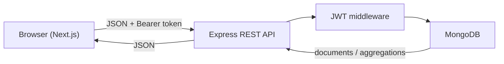
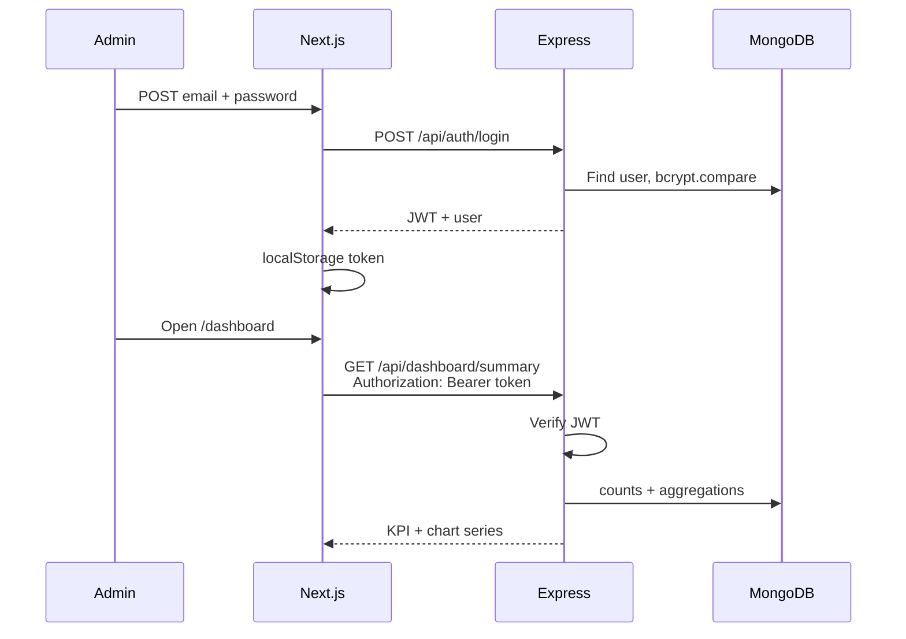

# Doctor Tracker

## Description

Doctor Tracker is a secure medical administration portal for managing doctors, the patients assigned to them, and live clinic analytics. An authenticated admin can search, filter, sort, and paginate records, then review KPI cards and charts that MongoDB computes on the server instead of in the browser.

## Setup Guide

The app is two packages: a Next.js frontend and a standalone Express API. Each has its own `.env.example` file.

### Prerequisites

- Node.js 18+
- npm
- MongoDB locally, or a MongoDB Atlas cluster

### 1. Clone the repository

```bash
git clone <repository-url>
cd Doctor-Tracker
```

### 2. Backend environment

Copy the backend example file and fill in real values:

```bash
cd backend
cp .env.example .env
npm install
```

On Windows PowerShell:

```powershell
cd backend
Copy-Item .env.example .env
npm install
```

`backend/.env.example`:

```
PORT=5000
MONGODB_URI=
JWT_SECRET=
CLIENT_URL=http://localhost:3000
ADMIN_NAME=
ADMIN_EMAIL=
ADMIN_PASSWORD=
```

| Variable         | Purpose                                                            |
| ---------------- | ------------------------------------------------------------------ |
| `PORT`           | API port (default `5000`)                                          |
| `MONGODB_URI`    | MongoDB connection string                                          |
| `JWT_SECRET`     | Secret used to sign and verify JWTs                                |
| `CLIENT_URL`     | Frontend origin allowed by CORS (example: `http://localhost:3000`) |
| `ADMIN_NAME`     | Display name for the seeded admin                                  |
| `ADMIN_EMAIL`    | Email for the seeded admin                                         |
| `ADMIN_PASSWORD` | Plain password hashed with bcrypt during seed                      |

### 3. Frontend environment

```bash
cd frontend
cp .env.example .env.local
npm install
```

On Windows PowerShell:

```powershell
cd frontend
Copy-Item .env.example .env.local
npm install
```

`frontend/.env.example`:

```
NEXT_PUBLIC_API_URL=http://localhost:5000/api
```

| Variable              | Purpose                                                     |
| --------------------- | ----------------------------------------------------------- |
| `NEXT_PUBLIC_API_URL` | Backend API base URL (example: `http://localhost:5000/api`) |

Do not commit `.env` or `.env.local`. Use the `.env.example` files as templates only.

### 4. Seed the admin user

From `backend`:

```bash
npm run seed:admin
```

This creates one admin from `ADMIN_NAME`, `ADMIN_EMAIL`, and `ADMIN_PASSWORD`. If an admin already exists, the script skips creation.

### 5. Start the API

```bash
cd backend
npm run dev
```

The API listens on `http://localhost:5000` by default.

### 6. Start the frontend

In a second terminal:

```bash
cd frontend
npm run dev
```

Open [http://localhost:3000/login](http://localhost:3000/login) and sign in with the seeded admin email and password.

## System Architecture

The frontend is a thin UI. It never talks to MongoDB. Protected pages call REST endpoints; Express authenticates the JWT, Mongoose reads or writes documents, and MongoDB aggregations shape dashboard data before it reaches the browser.



```
doctor-tracker/
├── frontend/     Next.js + React + Tailwind CSS
└── backend/      Node.js + Express + Mongoose
```

### Data model

- **User** — admin account (email + bcrypt password). Only role is `admin`.
- **Doctor** — name, specialization, hospital, phone, email.
- **Patient** — belongs to a doctor through `doctorId` (ObjectId reference). Stores contact details and `condition`.

A doctor can have many patients. Patient lists populate the doctor's name, specialization, and hospital. Deleting a doctor does not cascade-delete patients.

### Authentication flow



Missing, invalid, or expired tokens return `401`. The frontend clears auth and redirects to `/login`. Visiting `/login` while authenticated redirects to `/dashboard`.

### Request path for lists

Search, filters, sort, and pagination live in the URL (`/doctors?search=...&page=2`). The page reads those query params, sends them to the API, and renders either a desktop table or mobile cards. The browser does not filter a full in-memory list.

### Dashboard path

`GET /api/dashboard/summary` returns only the numbers the UI needs: totals, patients this month, average patients per doctor, top doctors, condition breakdown, and 30-day trends. Recharts draws the series. The client never downloads every doctor or patient to compute charts.

## Technical Decisions

### 1. Local React state instead of Redux or Context API

This app does **not** use Redux or the React Context API.

Each screen owns a small, short-lived piece of state: the doctors page keeps the current list, pagination, and modal flags; the patients page does the same; the dashboard keeps one summary payload. Those values are not shared across routes. When the admin leaves `/doctors` for `/patients`, the doctors list does not need to survive.

**Why not Redux**

Redux (or Redux Toolkit) is a good fit when many distant components read and write the same store: a cart, a complex editor, or a shared cache. Here there is no shared client cache. List state is already represented in the URL, and each page refetches on mount. A store, slices, action types, and a `Provider` would add moving parts without removing a real problem.

**Why not Context**

Context is lighter than Redux, but it still needs a provider at the root and it re-renders every consumer when the value changes. The only values that look “global” are the JWT and the current user. Those live in `localStorage` behind `frontend/lib/auth.js`. Layouts call `isAuthenticated()` / `getUser()` after mount. There is no theme, no locale, and no cross-page form draft that would justify a context.

**What we use instead**

- **URL search params** as the source of truth for search, filters, sort, and page number. Refreshing the browser restores the same list query.
- **`useState` / `useEffect`** for fetch status, form fields, and dialogs on that page.
- **Service modules** (`doctorService`, `patientService`, `dashboardService`) so components call named API functions instead of inlining `fetch`.
- **`localStorage`** for the JWT (`doctor-tracker-token`) and a small user object.

**Trade-off**

Each page repeats a similar load / error / `401` redirect pattern. That duplication is cheaper than a global store at this size. If a future feature needed a live shared notification bus or a multi-page wizard, Context (narrow, for that feature) would be the next step — not a Redux rewrite of the whole tree.

### 2. Dashboard analytics in MongoDB instead of the frontend

`GET /api/dashboard/summary` uses `countDocuments` and aggregation pipelines (`$lookup`, `$group`, `$sort`, `$limit`, date `$match`) and returns only the payload Recharts needs.

**Why aggregation**

- The frontend stays a display layer: KPI cards and charts receive already-shaped data.
- The browser never downloads the full doctor or patient collections.
- Counts, top doctors, condition totals, and 30-day trends stay consistent with the database, including doctors with zero patients.
- Missing days in the 30-day series are filled with `0` in the API so line charts stay continuous without extra frontend math.

**Trade-off**

Aggregation queries are more complex than `find()`. In return, payload size stays small and the UI does not re-implement analytics. Embedding every patient inside a doctor document would make those aggregations and the global patient search harder, which is why patients store a `doctorId` reference instead.

## Visual Evidence

Desktop uses a fixed sidebar, data tables, and a two-column chart grid. Below the `lg` breakpoint the sidebar becomes a drawer, tables become cards, and charts stack in a single column.

### Desktop

**Login**


**Dashboard** — KPI cards and MongoDB-backed charts.


**Doctors** — search, filters, sort, pagination, and a table with view / edit / delete actions.


**Patients** — search, filters, sort, pagination, and a table with view / edit / delete actions.


### Mobile

**Login**


**Dashboard** — stacked stats and charts.


**Doctors** — the same query controls, rendered as cards.


## Tech Stack

**Frontend:** Next.js, React, Tailwind CSS, `fetch()`, Recharts, React state + `localStorage`

**Backend:** Node.js, Express, JWT, bcrypt

**Database:** MongoDB, Mongoose

## API Documentation

All JSON error responses use:

```json
{
  "success": false,
  "message": "Human-readable error"
}
```

### Health

| Method | Path          | Auth | Description  |
| ------ | ------------- | ---- | ------------ |
| GET    | `/api/health` | No   | Health check |

### Auth

| Method | Path              | Auth         | Description                                |
| ------ | ----------------- | ------------ | ------------------------------------------ |
| POST   | `/api/auth/login` | No           | Login with email and password              |
| GET    | `/api/auth/me`    | Bearer token | Returns the authenticated user id and role |

Invalid credentials always return `401` with `"Invalid email or password."` so the API does not reveal whether an email exists.

### Doctors

All doctor endpoints require `Authorization: Bearer <token>`.

| Method | Path               | Description                                   |
| ------ | ------------------ | --------------------------------------------- |
| POST   | `/api/doctors`     | Create a doctor                               |
| GET    | `/api/doctors`     | List doctors (search, filter, sort, paginate) |
| GET    | `/api/doctors/:id` | Get a single doctor                           |
| PUT    | `/api/doctors/:id` | Update a doctor                               |
| DELETE | `/api/doctors/:id` | Delete a doctor                               |

List query parameters: `page`, `limit`, `search`, `specialization`, `hospital`, `fromDate`, `toDate`, `sortBy` (`createdAt` or `name`), `sortOrder` (`asc` or `desc`).

Deleting a doctor does not delete that doctor's patients.

### Patients

All patient endpoints require `Authorization: Bearer <token>`.

| Method | Path                              | Description                                    |
| ------ | --------------------------------- | ---------------------------------------------- |
| POST   | `/api/patients`                   | Create a patient under a doctor                |
| GET    | `/api/patients`                   | List patients (search, filter, sort, paginate) |
| GET    | `/api/patients/:id`               | Get a single patient                           |
| PUT    | `/api/patients/:id`               | Update a patient                               |
| DELETE | `/api/patients/:id`               | Delete a patient                               |
| GET    | `/api/doctors/:doctorId/patients` | List patients for a specific doctor            |

Create requires `doctorId`, `name`, `phone`, and `condition`. Optional fields: `email`, `age`, `gender`, `address`.

### Dashboard

| Method | Path                     | Auth         | Description                                    |
| ------ | ------------------------ | ------------ | ---------------------------------------------- |
| GET    | `/api/dashboard/summary` | Bearer token | KPI counts and chart aggregations from MongoDB |
